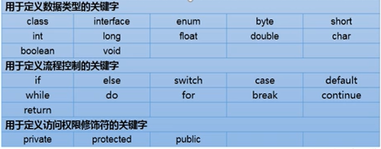
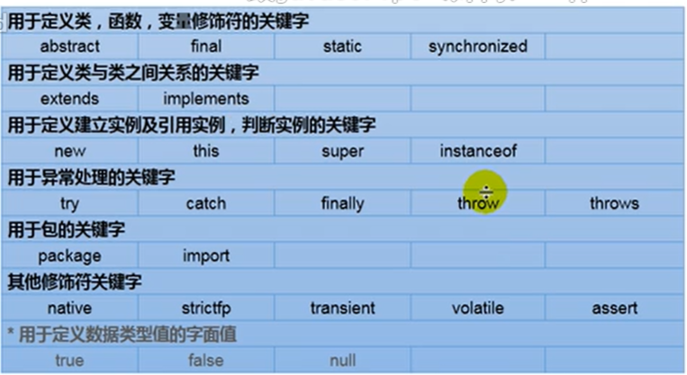
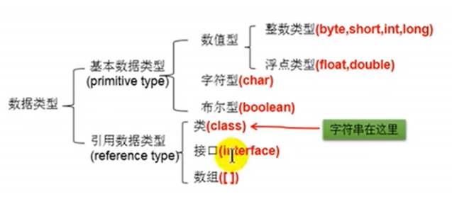
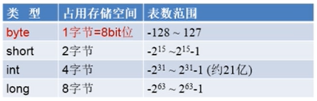
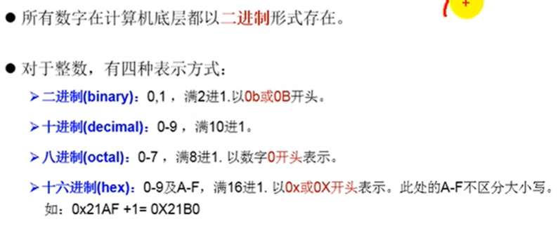
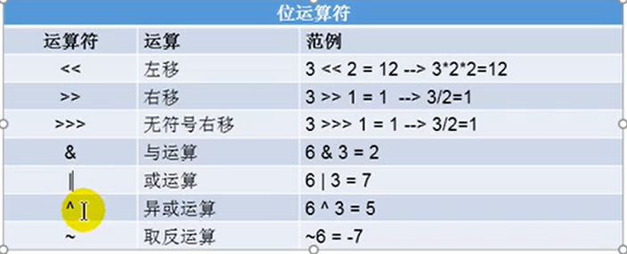
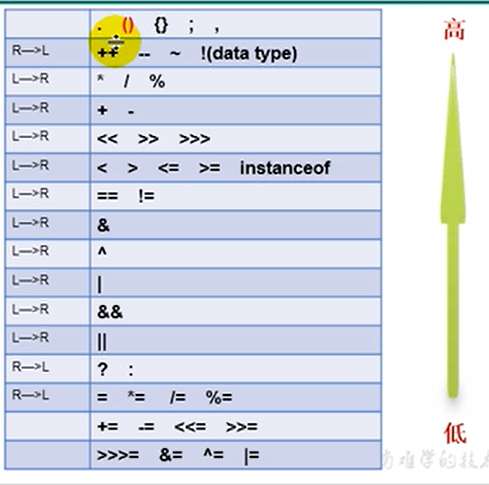

# 2021-10-10-p43-p

## 关键字和保留字

关键字被赋予特殊含义，用作专门用途的字符串，都是小写






## 标识符identifier

对变量、方法、类等要素命名时使用的字符序列

### 命名规范

类名、接口名：所有单词首字母大写；大驼峰

变量名、方法名：第一个单词小写，第二个单词开始首字母大写；小驼峰

包名：所有字母都小写

常量：所有字母都大写，多单词时，用下划线连接

## 变量





定义long，必须以L或者l结尾：long l1 = 34343434l；


char类型占2字节byte

ASCII

A64 、a97

UTF-8 、GBK==ANSI？


### boolean 

只能取两个值：true、false


### String 

引用数据类型

String 可以和8种数据类型做运算，且，只能做连接运算，运算结果仍然是String

```java
char c = 'a'; //97
int num = 10;
String str = "hello";

c + num + str; // 107hello
c + str + num; // ahello10
c + (num + str); // a10hello
(c + num) + str; // 107hello
num + str + c; // hello10a


"*    *";
'*' + '\t' + '*'; // 93
'*' + "\t" + '*'; // *    *
'*' + '\t' + "*"; // 51*
'*' + ('\t' + "*"); // *    *
```


## 类型转换

### 基本数据类型之间运算规则

只讨论7种，byte short int long float double char

#### 自动类型提升

当容量小的遍历与容量大的数据类型做运算时，自动提升为大的类型,

容量大小指的是数的范围大小

byte、char、short-->int-->long-->float-->double

特别的，当byte、char、short做运算时，结果为int类型

```java
byte b1 = 2;
int i1 = 129;
int i2 = b1 + i1; // 需要用更大的类型进行接收
long l1 = b1 + i1; // 需要用更大的类型进行接收
float f = b1 + i1; // 131.0

short s1 = 123;
double d1 = s1; //123.0


/*********************************/
char c1 = 'a';
int i3 = 10;
int i4 = c1 + i3; // 'a' = 97 ;  i4 = 107

short s2 = 10;
int i5 = s2 + c1; // 用short和char接收都报错

byte b2 = 10;
int i6 = b2 + b1; // byte和byte做运算也得用int接收
```

#### 强制类型转换

自动类型提升的逆运算

1. 需要使用强转符：()
2. 强制类型转换，可能导致精度损失

```java
// 有精度损失
double d1 = 12.3;
int i1 = (int)d1; // 12, 直接舍去小数点，截断操作 ，损失精度

int i2 = 128;
byte b = (byte)i2; // -128,也是精度损失

//无精度损失
long l1 = 123;
short s2 = (short)11;


long l = 123123; // 没有加l，会认为是int，自动类型转换为long，如果数值过大，会编译失败报错

// float f1 = 12.3; // 没有加f， 会认为是double， 大转小，自动类型转换失败，编译失败


```

## 进制



### 进制转换


## 运算符

```java
int j = 1;
j += 1; // j = j + 1;


int i = 1;  

i *= 0.1; // i = 0; 因为*= += /= 这类的运算符是不会改变数据类型的，乘的结果0.1会强制转换成int，所以结果是0
```


### 位运算符



- 位运算符操作的都是整形的数据
- <<: 在一定范围内，每向左移一位，相当于*2；
- \>>：在一定范围内，每向右移一位，相当于/2


取模运算，结果符号与被模数的符号相同。


```java
int num1 = 10;
int num2 = 20;
// 交换num1和num2
int temp = num2;
num2 = num1;
num1 = temp;
// 方法一  定义临时变量
// 方式二 好处：不用定义临时变量
// 弊端： 有可能溢出；有局限性，只能是数值型
num1 = num1 + num2;
num2 = num1 - num2;
num1 = num1 - num1;
// 方法三 使用位运算符
num1 = num1 ^ num2;
num2 = num1 ^ num2;
num1 = num1 ^ num2;

```


### 三元运算符

```java
int a = 12;
int b = 30;
int c = -43;
int max1 = (n1 > n2)? n1:n2;
int max2 = (max1 > n3) ? max1:n3;
int max3 = ((n1 > n2)? n1:n2 > n3) ? (n1 > n2)? n1:n2:n3;
```

### 运算符优先级




## 流程控制

顺序结构、分支结构、循环结构


## 输入

```java
import  java.util.Scanner;
public class ifscanner {
    public static void main(String[] args) {
        Scanner scan = new Scanner(System.in);
        System.out.println("请输入一个整数：");
        int num  = scan.nextInt();
        System.out.println(num);

        System.out.println("请输入一个字符串：");
        String s ;
        s = scan.next();
        System.out.println(s);

        System.out.println("请输入一个小数：");
        double d ;
        d = scan.nextDouble();
        System.out.println(d);

        System.out.println("请输入一个布尔：");
        boolean b;
        b = scan.nextBoolean();
        System.out.println(b);
        // 没有提供char的输入，可以使用字符串来获取。
    }
}

```


## 获取一个随机数

```java
import java.lang.Math;
public class randint {
    public static void main(String[] args) {
        // 随机获取一个10-99的整数
        int value = (int)(Math.random() * 90 + 10);
        System.out.println(value);
    }
}
```


## switch-case

```java
public class SwitchCaseTest {
    public static void main(String[] args) {
        int n = 2;
        switch (n){ // 不允许放bool类型，只能byte、short、char、int、枚举类型、String
            case 0:
                System.out.println("0");
                break;
            case 1:
                System.out.println("1");
                break;
            case 2:
                System.out.println("2");
                break;
            default:
                System.out.println("default");
        }
    }
}
```


