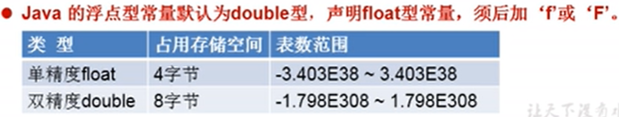

# 2021-10-10-p43-p

## 关键字和保留字

关键字被赋予特殊含义，用作专门用途的字符串，都是小写

## 标识符identifier

对变量、方法、类等要素命名时使用的字符序列

### 命名规范

类名、接口名：所有单词首字母大写；大驼峰

变量名、方法名：第一个单词小写，第二个单词开始首字母大写；小驼峰

包名：所有字母都小写

常量：所有字母都大写，多单词时，用下划线连接

## 变量

定义long，必须以L或者l结尾：long l1 = 34343434l；

char类型占2字节byte

ASCII

A64 、a97

UTF-8 、GBK==ANSI？

boolean 只能取两个值：true、false

## 运算符

## 流程控制