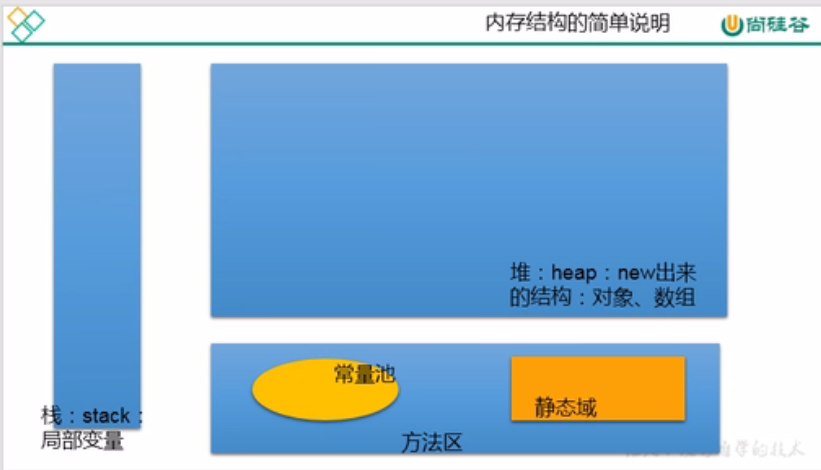
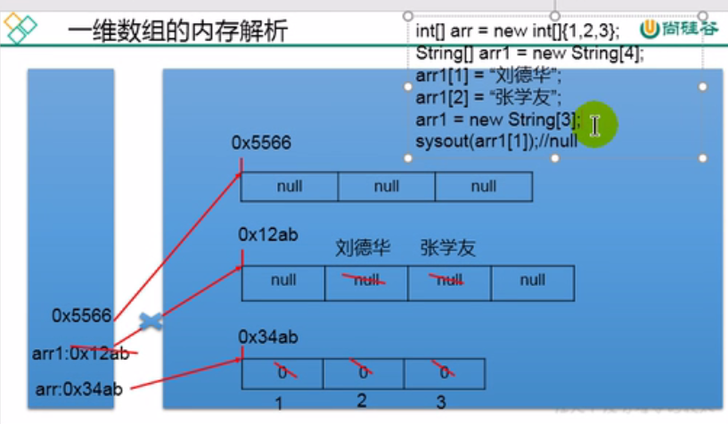
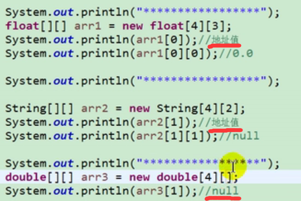
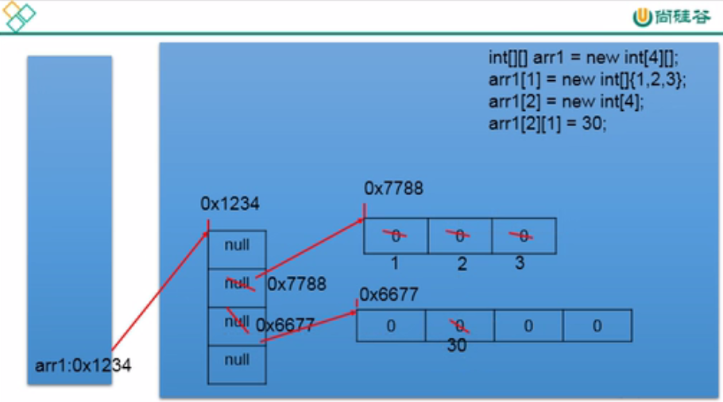

[TOC]

# 2021-10-14-p112-p

## 数组

数组(Array)，是多个相同类型数据按一定顺序排列的集合，并使用一个名字命名，并通过编号的方式对这些数据进行统一管理。

### 相关概念

数组名、元素、角标下标索引、数组的长度、元素的个数

### 特点

数组属于引用数据类型的遍历，数组的元素既可以是基本也可以是引用数据类型

开辟一整块连续的空间，长度一旦确定，就不能修改

### 一位数组

- 声明和初始化
- 调用指定位置的元素
- 获取数组长度
- 遍历数组
- 元素默认初始化值
- 内存解析

```java
public class ArrayTest {
    public static void main(String[] args) {
        int num;
        num = 10;

        int[] ids; // 声明
        // 静态初始化 数组的初始化和数组元素的赋值操作同时进行
        ids = new int[]{1001, 1002, 1003};
        // 动态初始化 数组的初始化和数组元素的赋值操作分开进行
        String[] names = new String[5];
        // 一旦初始化完成，长度就确定了
        names[0] = "lcp";
        names[1] = "pb";
        names[3] = "pb";
        names[4] = "pb";
        names[2] = "pb";

        // 获取数组的长度 length
        int size = names.length;
        System.out.println(size);
        // 遍历数组
        for (int i=0; i<size; i++){
            System.out.println(names[i]);
        }
        for(String s : names){
            System.out.println(s);
        }

        // 默认初始化值
//        >数组元素是整型:0
//        >数组元素是浮点型: 0.0
//        >数组元素是char型:0或' \u0000',而非'0'
//        >数组元素是boolean型: false
//        >数组元素是引用数据类型: nu11
    }
}
```





String其实是放在常量区的，这里是刚开始讲，便于理解放这里

## 多维数组

- 声明和初始化
- 调用指定位置的元素
- 获取数组长度
- 遍历数组
- 元素默认初始化值
- 内存解析

```java
public class MulArrayTest {
    public static void main(String[] args) {
        int arr[] = new int[]{1, 2, 3};
        // 静态初始化
        int [][] arr1 = new int[][]{{1, 2, 3}, {4, 5},{6, 7, 8}};

        // 动态初始化
        String [][] arr2 = new String[3][5];
        String [][] arr3 = new String[3][]; // 没有指定第二维


        System.out.println(arr1[0][1]);
        System.out.println(arr2[2][1]);

        // 使用时需要指定第二维
        arr3[1] = new String[4];
        System.out.println(arr3[1][0]);

        // 获取长度
        System.out.println(arr1.length);
        System.out.println(arr1[0].length);
        System.out.println(arr1[1].length);

        // 数组的初始化
    }
}
```




针对于初始化方式- :比如: String\[][] [][] arr2 = new String\[3][5];
外层元素的初始化值为:地址值
内层元素的初始化值为:与一维数组初始化情况相同

针对于初始化方式二:  比如: int[] [] arr=new String\[3][]

外层元素的初始化值为: null
内层元素的初始化值为:不能调用，否则报错




