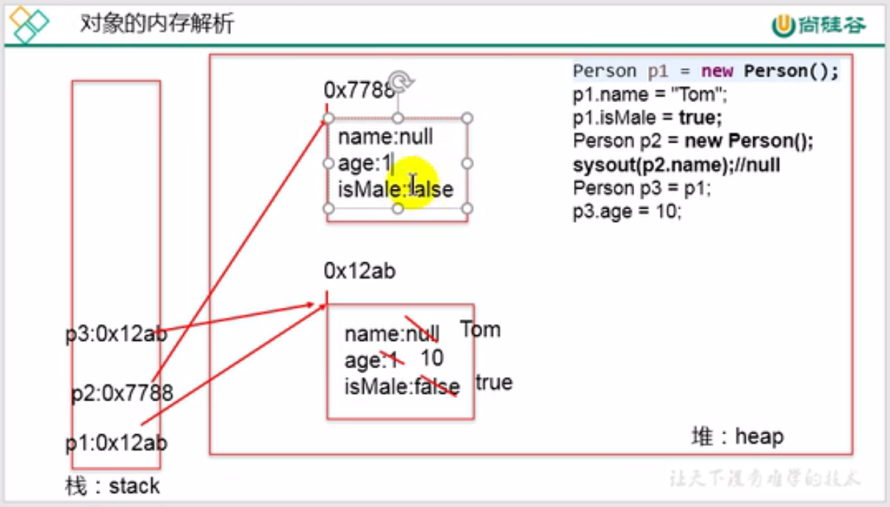
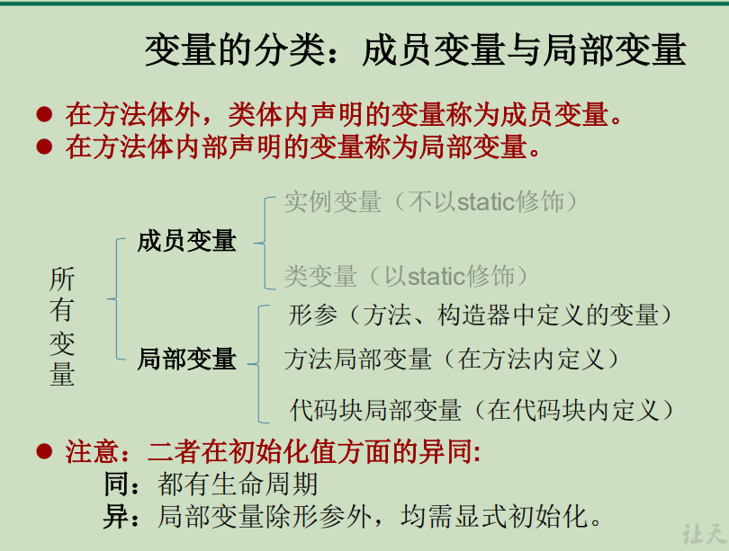
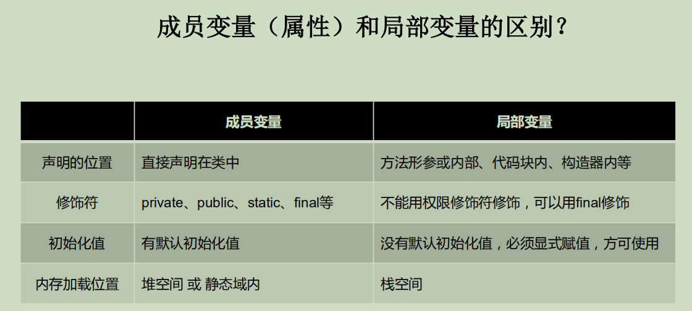

# 2021-10-17-p172-p

## 面向对象的三条主线

- Java类及类的成员

  重点：属性 方法 构造器

  代码块 内部类

- 面向对象的三大特征

  封装 继承 多态

- 其他关键字

  this super static final abstract interface package import 

面向过程：强调功能行为，以函数为最小单位，考虑怎么做

面向对象：强调具备了功能的对象，以类/对象为最小单位，考虑谁来做

## 面向对象的两个要素

类是对一类事物的描述，是抽象的、概念上的定义

对象是实际存在的该类事物的每个个体，因而也称为实例(instance)

面向对象程序设计的重点是**类的设计**

类的设计，**其实就是类的成员的设计**

## 成员变量局部变量

