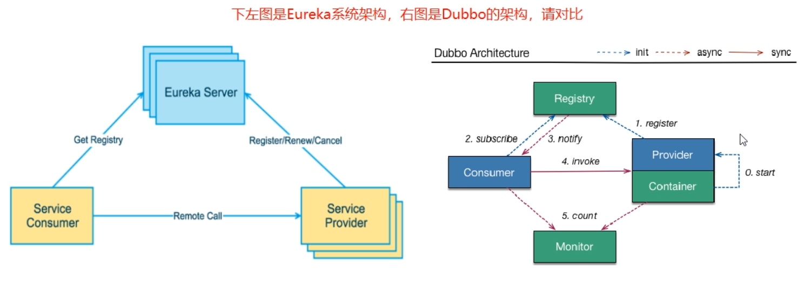

# 微服务-10-14

SpringCloud=分布式微服务架构的一站式解决方案，是多种微服务架构落地技术的集合体，俗称微服务全家桶


```
<!-- 1、只是声明依赖，并不实际引入，子项目按需声明使用的依赖 -->
<!-- 2、子项目可以继承父项目的 version 和 scope -->
<!-- 3、子项目若指定了 version 和 scope，以子项目为准 -->
<dependencyManagement>
 </dependencyManagement>
```


## 订单-支付模块微服务

1. 建model
2. 改POM
3. 写YML
4. 主启动
5. 业务类

一步步带着写code，

entities --> dao  --> mapper -->service --> serviceImpl --> Controller

### entities

```java
package com.atguigu.springcloud.entities;

import lombok.AllArgsConstructor;
import lombok.Data;
import lombok.NoArgsConstructor;

/**
 * @author  liangchen
 * @create  2021/10/15 16:25
 * @desc
 **/
@Data
@AllArgsConstructor
@NoArgsConstructor
public class Payment {
    private Long id;
    private String serial;
}
```

### dao

```java
package com.atguigu.springcloud.dao;

import com.atguigu.springcloud.entities.Payment;
import org.apache.ibatis.annotations.Mapper;
import org.apache.ibatis.annotations.Param;

/**
 * @author  liangchen
 * @create  2021/10/15 16:38
 * @desc
 **/
@Mapper
public interface PaymentDao {
    public int create(Payment payment);
    public Payment getPaymentById(@Param("id") Long id);

}
```

### mapper

```xml
<?xml version="1.0" encoding="UTF-8"?>
<!DOCTYPE mapper PUBLIC "-//mybatis.org//DTD Mapper 3.0//EN" "http://mybatis.org/dtd/mybatis-3-mapper.dtd">
<mapper namespace="com.atguigu.springcloud.dao.PaymentDao">

	<!-- 必须会手打，不提示情况下 -->
    <insert id="creat" parameterType="Payment" useGeneratedKeys="true" keyProperty="id">
        insert into payment(serial) values(#{serial});
    </insert>
    
    <!--写resultMap是为了控制数据库里的列名和实体类中的名有一个对应关系，防止出错   -->
    <resultMap id="BaseResultMap" type="com.atguigu.springcloud.entities.Payment">
        <id column="id" property="id" jdbcType="BIGINT"/>
        <id column="serial" property="serial" jdbcType="VARCHAR"/>
    </resultMap>
    <select id="getPaymentById" parameterType="Long" resultMap="BaseResultMap">
        select  * from payment where id=#{id}
    </select>


</mapper>

```

### service

```java
package com.atguigu.springcloud.service;

import com.atguigu.springcloud.entities.Payment;
import org.apache.ibatis.annotations.Param;


/**
 * @author  liangchen
 * @create  2021/10/15 17:10
 * @desc
 **/

public interface PaymentService {
    public int create(Payment payment);
    public Payment getPaymentById(@Param("id") Long id);

}
```

### serviceImpl

```java
package com.atguigu.springcloud.service.impl;

import com.atguigu.springcloud.dao.PaymentDao;
import com.atguigu.springcloud.entities.Payment;
import com.atguigu.springcloud.service.PaymentService;
import org.springframework.stereotype.Service;

import javax.annotation.Resource;

/**
 * @author  liangchen
 * @create  2021/10/15 17:11
 * @desc
 **/
@Service
public class PaymentServiceImpl implements PaymentService {

    @Resource
    private PaymentDao paymentDao;

    public int create(Payment payment){
        return paymentDao.create(payment);
    }
    public Payment getPaymentById(Long id){
        return paymentDao.getPaymentById(id);
    }

}
```

### Controller

```java
package com.atguigu.springcloud.controller;

import com.atguigu.springcloud.entities.CommonResult;
import com.atguigu.springcloud.entities.Payment;
import com.atguigu.springcloud.service.PaymentService;
import lombok.extern.slf4j.Slf4j;
import org.springframework.web.bind.annotation.GetMapping;
import org.springframework.web.bind.annotation.PathVariable;
import org.springframework.web.bind.annotation.PostMapping;
import org.springframework.web.bind.annotation.RestController;

import javax.annotation.Resource;

/**
 * @author  liangchen
 * @create  2021/10/15 17:16
 * @desc
 **/
@RestController
@Slf4j
public class PaymentController {
    @Resource
    private PaymentService paymentService;

    // 写操作， 真真正正操作，
    @PostMapping(value = "/payment/creat")
    public CommonResult creat(Payment payment){
        int result = paymentService.create(payment);
        log.info("*****插入结果："+ result);

        if(result > 0){
            return new CommonResult(200,"插入数据成功",result);
        }else {
            return new CommonResult(444,"插入失败", null);
        }
    }
    // 从数据库拉数据，取数据
    @GetMapping(value = "/payment/get/{id}")
    public CommonResult getPaymentById(@PathVariable("id") Long id){
        Payment payment = paymentService.getPaymentById(id);
        log.info("*****插入结果："+ payment);

        if(payment != null){
            return new CommonResult(200,"查询成功",payment);
        }else {
            return new CommonResult(444,"没有对应记录，查询ID是"+id, null);
        }
    }
}
```


## 热部署Devtools

只能在开发阶段使用

## RestTemplate

RestTemplate提供了多种便捷访问远程Http服务的方法，
是一种简单便捷的访问restful服务模板类，是Spring提供的用于访问Rest服务的客户端模板工具集

### 使用

使用restTemplate访问restful接口非常的简单粗暴无脑。

(url, reqtlestMap, ResponseBean.class)这三个参数分别代表

REST请求地址、请求参数、HTTP响应转换被转换成的对象类型。

### config.ApplicationContextConfig.java 配置文件

```java
package com.atguigu.springcloud.config;

import org.springframework.context.annotation.Bean;
import org.springframework.context.annotation.Configuration;
import org.springframework.web.client.RestTemplate;

@Configuration
public class ApplicationContextConfig {
    @Bean
    public RestTemplate getRestTemplate(){
        return new RestTemplate();
    }
}
// 注解方式依赖注入
//applicationcontext.xml <bean id="" class=">
 
```

查询：localhost/consumer/payment/get/31
插入：localhost/consumer/payment/create?serial=111

插入成功，但是存的内容是null，不要忘记@RequestBody注解

```java
// 写操作， 真真正正操作，   要在provider的controller中添加注解
@PostMapping(value = "/payment/create")
public CommonResult creat(@RequestBody Payment payment){
```


## 工程重构

提取重复的部分代码

新建个工程cloud-api-commons

maven中 clean-install

在每个用到实体类的pom里加进这些

```xml
<dependency>
    <groupId>com.atguigu.springcloud</groupId>
    <artifactId>cloud-api-commons</artifactId>
    <version>${project.version}</version>
    <scope>compile</scope>
</dependency>
```


## 服务注册中心

在传统的rpc远程调用框架中，管理每个服务与服务之间依赖关系比较复杂。管理比较复杂，所以需要使用服务治理，管理服务于服务之间依赖关系，可以实现服务调用、负载均衡、容错等，实现服务发现与注册。

### Eureka





创建cloud-erueka-server7001模块，   EurekaMain7001

```java
package com.atguigu.springcloud;

import org.springframework.boot.SpringApplication;
import org.springframework.boot.autoconfigure.SpringBootApplication;
import org.springframework.cloud.netflix.eureka.server.EnableEurekaServer;

@SpringBootApplication
@EnableEurekaServer
public class EurekaMain7001 {
    public static void main(String[] args) {
        SpringApplication.run(EurekaMain7001.class, args);
    }
}
```

http://localhost:7001/

```
在server里也添加这个注解 PaymentMain8001.java
@EnableEurekaClient
```

### 集群

相互注册，相互守望


负载均衡@LoadBalanced，赋予负载均衡的能力